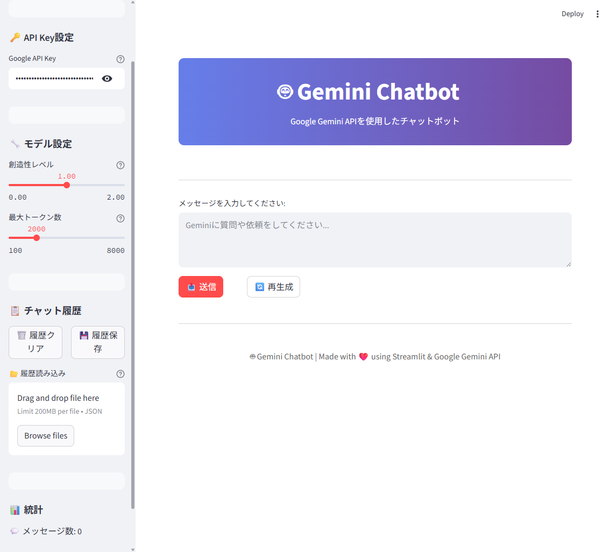

# 🤖 Gemini Chatbot

Google Gemini APIを使用した自分専用のチャットボットアプリケーションです。StreamlitのWebインターフェースを通じて、Gemini APIの機能を実践的に学ぶことができます。

---

## 📋 画面キャプチャ

以下は本アプリの画面例です（クリップボードから貼り付けてください）:

> ※ 画像ファイル`screenshot.png`をこのREADMEと同じディレクトリに保存し、上記のリンクが正しく表示されるようにしてください。  
>  
> 画像の取得方法例（Windowsの場合）:  
> 1. アプリを起動し、画面を表示  
> 2. `PrintScreen`キーで画面をコピー  
> 3. ペイント等に貼り付けて保存  
> 4. `screenshot.png`としてプロジェクト直下に配置

---

## 📋 目次

- [特徴](#特徴)
- [必要要件](#必要要件)
- [Gemini API Keyの取得方法](#gemini-api-keyの取得方法)
- [インストール手順](#インストール手順)
- [使用方法](#使用方法)
- [機能説明](#機能説明)
- [トラブルシューティング](#トラブルシューティング)
- [注意事項](#注意事項)

## ✨ 特徴

- 🆓 **無料**: Gemini APIの無料枠を使用
- 🖥️ **直感的なUI**: Streamlitによる美しいWebインターフェース
- 💬 **リアルタイムチャット**: Geminiとの自然な対話
- 📊 **設定可能**: 創造性レベルやトークン数の調整
- 💾 **履歴管理**: チャット履歴の保存・読み込み
- 🔄 **再生成機能**: 回答の再生成
- 📈 **統計表示**: メッセージ数や文字数の表示

## 📦 必要要件

- Python 3.8以上
- インターネット接続
- Google アカウント

## 🔑 Gemini API Keyの取得方法

### 1. Google AI Studioにアクセス

1. [Google AI Studio](https://makersuite.google.com/app/apikey) にアクセス
2. Googleアカウントでログイン

### 2. API Keyの作成

1. 「Create API Key」または「APIキーを作成」をクリック
2. 既存のGoogleクラウドプロジェクトを選択するか、新しく作成
3. 生成されたAPI Keyをコピーして保存

### 3. 重要な注意事項

- ⚠️ **API Keyは機密情報です** - 他人と共有しないでください
- 📝 **安全な場所に保存** - パスワードマネージャーなどを使用
- 🔄 **定期的に更新** - セキュリティのため定期的に新しいキーを生成

## 🚀 インストール手順

### 1. リポジトリのクローン